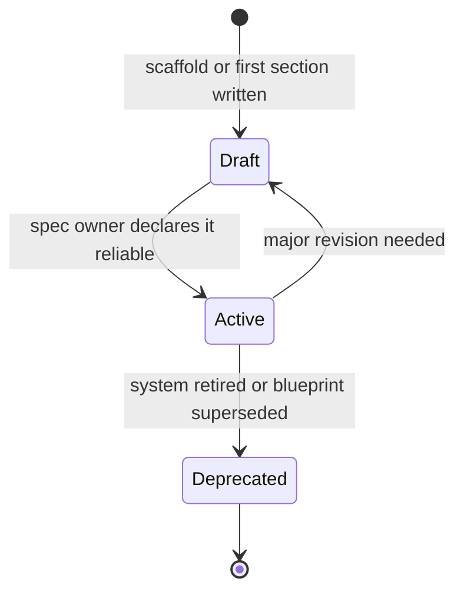
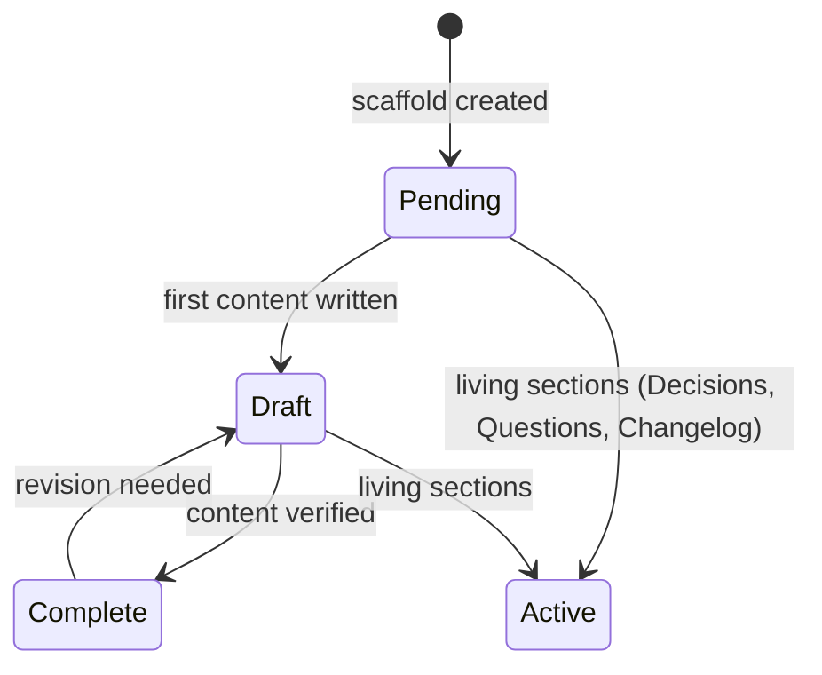
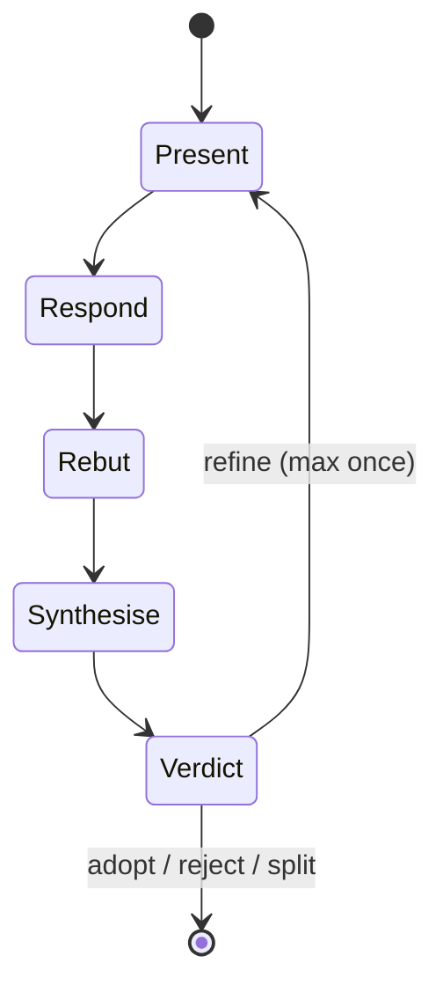
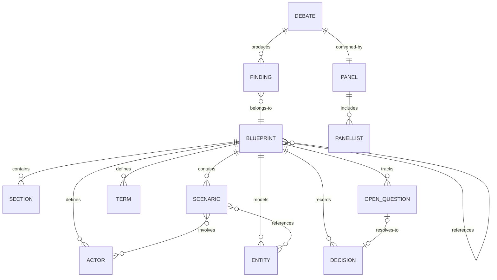

# Domain Model

## Blueprint

A living product specification for a system, feature, or product area.

**States:**

- **Draft** — under construction; sections may be incomplete or unverified. Not yet reliable for decision-making.
- **Active** — the team's shared reference. Maintained and kept current. Trusted for decisions.
- **Deprecated** — no longer maintained. The system it describes has been retired or a replacement blueprint exists.

**Tier (orthogonal to status):**

| Tier | Name | Sections covered | Sufficient for |
|------|------|-----------------|----------------|
| 1 | Skeleton | Context, Scope, Actors, Terminology | Aligning on vocabulary and boundaries |
| 2 | Workable | + Stories, Scenarios, Domain Model | Starting implementation discussions |
| 3 | Authoritative | + Error scenarios, Requirements, Decision Log | Single source of truth |

A blueprint's tier can advance while it remains in Draft status. Tier describes completeness; status describes reliability.

**Invariants:**
- A blueprint has exactly one Spec Owner at all times.
- Each term in the terminology section has exactly one definition — no synonyms, no homonyms.
- Every actor that appears in a scenario must be defined in the actors section.
- Every entity referenced in a scenario must be defined in the domain model.

**Relationships:**
- Contains 11 Sections (one-to-many, ordered)
- Contains zero or more Scenarios (one-to-many)
- Contains zero or more Terms (one-to-many)
- Contains zero or more Entities (one-to-many)
- Contains zero or more Decisions (one-to-many)
- Contains zero or more Open Questions (one-to-many)
- Owned by one Spec Owner (many-to-one)
- May reference other Blueprints (many-to-many)

---

## Section

One part of a blueprint, stored as an individual file.

**States:**

- **Pending** — placeholder exists but no content has been written.
- **Draft** — content exists but has not been verified or reviewed.
- **Complete** — content has been verified; considered stable.
- **Active** — for living sections (Decisions, Questions, Changelog) that are never "complete" but are continuously maintained.

**Invariants:**
- A section belongs to exactly one blueprint.
- A section has exactly one status at any time.
- Living sections (Decisions, Questions, Changelog) use Active, not Complete.

---

## Scenario

An end-to-end flow describing how something works.

**Structure (not states — a scenario does not transition):**
- **Trigger** — what initiates the flow (user action, time event, external event)
- **Preconditions** — what must be true before the flow begins
- **Steps** — numbered sequence of what happens
- **Outcomes** — what has changed when the flow completes
- **Error paths** — what happens when individual steps fail

**Invariants:**
- Every scenario has a trigger. No trigger means no scenario.
- Every scenario has at least one error path. Happy-path-only scenarios are incomplete.
- Every actor in a scenario is defined in the actors section.
- Every entity in a scenario is defined in the domain model.

**Relationships:**
- Belongs to one Blueprint (many-to-one)
- References one or more Actors (many-to-many)
- References one or more Entities (many-to-many)

---

## Term

A shared vocabulary entry.

**Invariants:**
- One concept, one name. No "also known as."
- The definition is one sentence that a newcomer can understand.
- If code uses a different name, the code name is flagged for cleanup — not added as a synonym.

---

## Entity

A domain concept with lifecycle.

**Structure:**
- **Definition** — what it is, in one sentence
- **States** — named states with descriptions
- **Transitions** — named moves between states, each with a trigger
- **Invariants** — what must always be true regardless of state
- **Lifecycle owner** — which actor creates, modifies, and retires it

---

## Panel

A group of simulated expert perspectives.

**Modes:**

| Mode | Size | Panellists | Used for |
|------|------|-----------|----------|
| Quick | 3 | Product Owner, Engineer, User Advocate | Routine fixes, small changes |
| Standard | 5 | Default panel (all five) | Standard changes |
| Full | 9 | Default + Extended | Major proposals, contested changes |

**Invariants:**
- The panel does not vote. Consensus is reached through debate convergence.
- Every panellist responds to every item. Silence is not consent.
- A single panellist may record a reservation while allowing consensus.

---

## Debate

A structured discussion following the 5-step protocol.

**Steps:**

- **Present** — state the item, its context, why it matters, and a candidate resolution.
- **Respond** — each panellist weighs in using their character card. "No objection" is valid.
- **Rebut** — panellists respond to each other. One round only.
- **Synthesise** — neutral summary of where the panel stands. Not attributed to any panellist.
- **Verdict** — one of four outcomes.

**Invariants:**
- Maximum two cycles total (one refine allowed).
- If a refined proposal does not reach consensus, it becomes a split.
- Split verdicts are deferred to the Spec Owner — the panel presents both sides, it does not resolve the disagreement.

---

## Decision

A settled choice recorded in the decision log.

**Structure:**
- What was decided
- Why (the rationale — not just the outcome)
- Who decided
- What alternatives were considered
- Date

**Invariants:**
- Every decision has rationale. Decisions without rationale get re-debated.
- Resolved open questions become decisions.

---

## Open Question

An unresolved issue.

**Structure:**
- The question (precise statement)
- Owner (one person)
- Deadline
- What it blocks

**Invariants:**
- Every open question has an owner and a deadline.
- When resolved, the question moves to the decision log with full rationale.

---

## Finding

An issue discovered during review or audit of a blueprint.

**Structure (not states — a finding does not transition):**
- **Location** — which section and specific element contains the problem
- **Problem** — what is wrong and why it matters
- **Impact** — what goes wrong if not fixed
- **Resolution** — the fix needed (review) or fix shape (audit)

**Classification (context-dependent):**
- In **audit**: severity is Blocking (must fix before the blueprint is reliable) or Advisory (should fix to improve quality)
- In **review**: findings are debated items with verdicts (consensus-adopt, consensus-reject, refine, split)

**Invariants:**
- Every finding identifies a specific location — not a vague area.
- Every finding states impact — why this matters, not just that it's wrong.
- Audit findings must have a severity classification with justification.
- Review findings must have a verdict after debate.

**Relationships:**
- Produced by one Debate or Audit (many-to-one)
- Belongs to one Blueprint's review or audit (many-to-one)

---

## Actor

A role that interacts with the blueprint system. Actors are defined by what they can and cannot do — not by lifecycle states.

**Structure (not states — actors do not transition):**
- **Description** — who this actor is and in what capacity they interact
- **Can do** — permitted actions
- **Cannot do** — explicit restrictions

**Invariants:**
- Every actor must appear in at least one scenario.
- Every actor has explicit can-do and cannot-do boundaries.
- Actor names are used consistently across all sections — no synonyms.

**Relationships:**
- Participates in one or more Scenarios (many-to-many)
- Defined in one Blueprint (many-to-one)

---

## Entity Relationships

