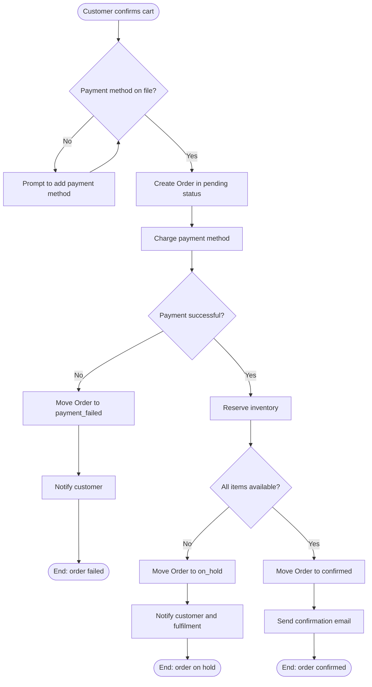
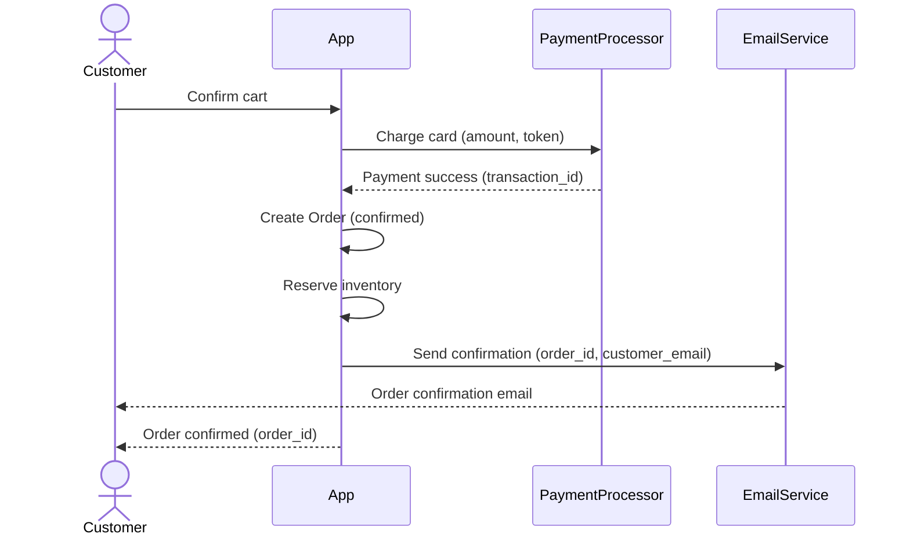
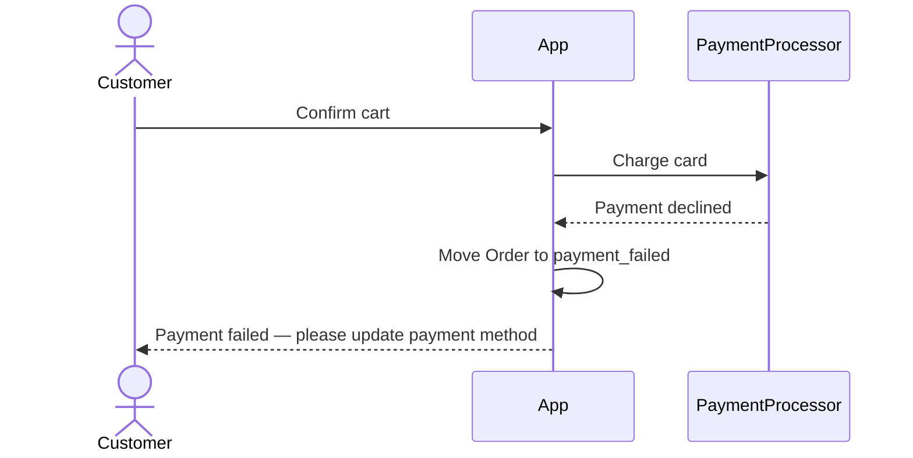
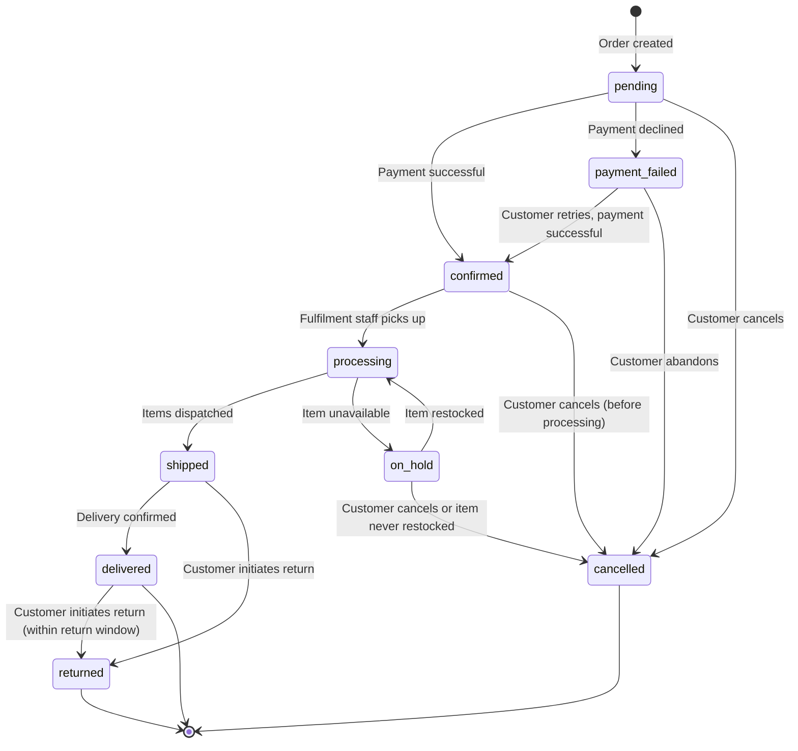
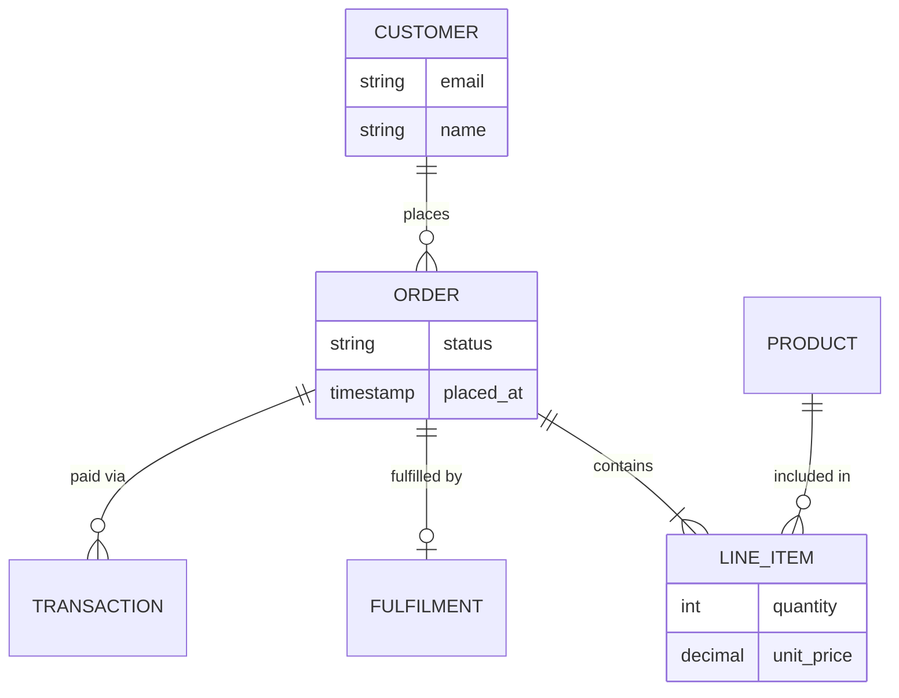

# Diagram Guide

When to use diagrams, which type to use, and Mermaid patterns for each.

Diagrams compress complex flows into a form that is faster to scan than prose. Use them where a flow has branching, multiple actors, or is long enough that a reader would lose the thread. Do not use them instead of prose — prose is searchable, linkable, and readable in any context. Use them alongside.

All diagrams use [Mermaid](https://mermaid.js.org), which renders in GitHub, Notion, VS Code (with extensions), and most modern documentation tools.

---

## Choosing the right diagram type

| Situation | Diagram type |
|-----------|-------------|
| A user flow with decision points | Flowchart |
| Multiple actors passing data or control between them | Sequence diagram |
| An entity moving through states | State diagram |
| Entities and how they relate to each other | Entity-relationship diagram |

---

## Flowchart — user flows and decision trees

Use for: single-actor journeys, flows with branching, step-by-step processes.



**Shapes:**
- `([text])` — start/end (rounded rectangle)
- `[text]` — process step (rectangle)
- `{text}` — decision (diamond)
- `((text))` — connector

**Tips:**
- Keep labels short — one action or one question
- Decision diamonds should always have labelled branches
- Every branch should reach a terminal state or loop explicitly
- Use `TD` (top-down) for step-by-step flows; `LR` (left-right) for pipelines

---

## Sequence diagram — multi-actor interactions and data flows

Use for: flows involving more than one actor passing data or control, API interactions, event-driven flows.



**Syntax:**
- `->>` — synchronous message (request)
- `-->>` — response
- `-x` — message that fails
- `actor Name` — a human actor (displayed with a person icon)
- `participant Name` — a system participant

**For failure paths:**



**Tips:**
- Keep actors to 3-5; more than that and the diagram becomes hard to read
- Show the response to every request — what comes back matters
- For async flows, add a note: `Note over App: waits for webhook`

---

## State diagram — entity lifecycles

Use for: any entity with more than two states, showing what triggers each transition.



**Tips:**
- Label every transition with what triggers it
- Every state should have a path to a terminal state (`[*]`)
- Group related states with comments if the diagram is large:
  ```
  state "Active states" as active {
      confirmed
      processing
      shipped
  }
  ```

---

## Entity-relationship diagram — domain model

Use for: showing how entities relate to each other, cardinality, naming relationships.



**Cardinality:**
- `||--||` — exactly one to exactly one
- `||--o|` — exactly one to zero or one
- `||--|{` — exactly one to one or more
- `||--o{` — exactly one to zero or more
- `o|--o{` — zero or one to zero or more

**Tips:**
- Include only the fields that matter for understanding the domain — not every column
- Relationship labels describe the relationship in plain English ("places", "contains", "fulfilled by")
- For large models, split into multiple diagrams by bounded context

---

## When not to use a diagram

- **Simple linear flows** — if there are no branches and only one actor, prose is clearer
- **Already obvious from the prose** — a diagram that mirrors the text exactly adds no value
- **More than ~8 nodes or ~6 actors** — diagrams become hard to read; break into sub-diagrams
- **As a substitute for text** — diagrams cannot be searched, linked to precisely, or read in plain text form

---

## Diagram placement

Place diagrams **after** the prose they illustrate:

```markdown
### Order Placement

1. Customer confirms cart...
2. System charges payment...
[full prose scenario]

**Flow:**

\`\`\`mermaid
flowchart TD
...
\`\`\`
```

Label every diagram with a caption so it can be referenced:

```markdown
*Figure 1: Order placement — happy path and payment failure*
```
