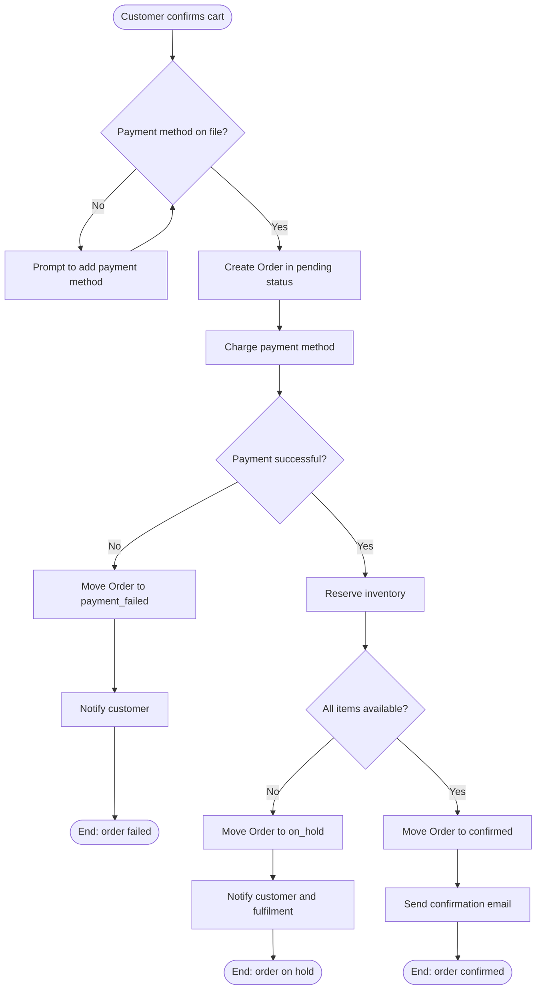
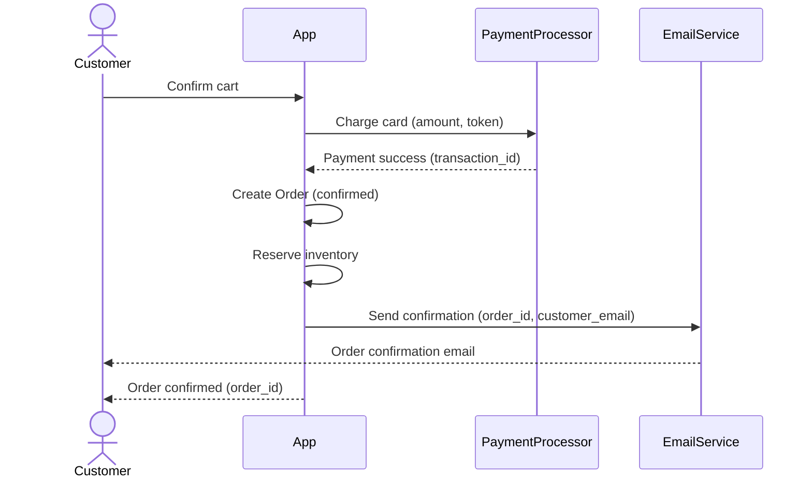
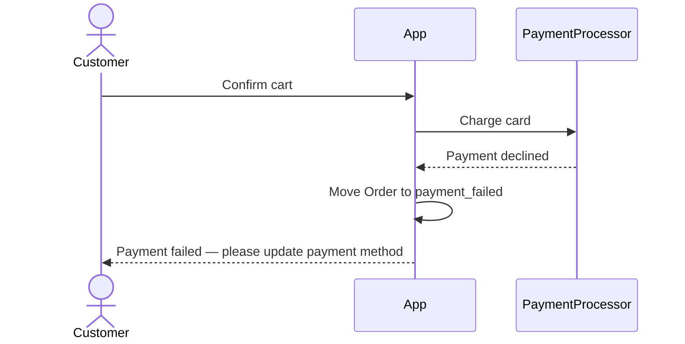
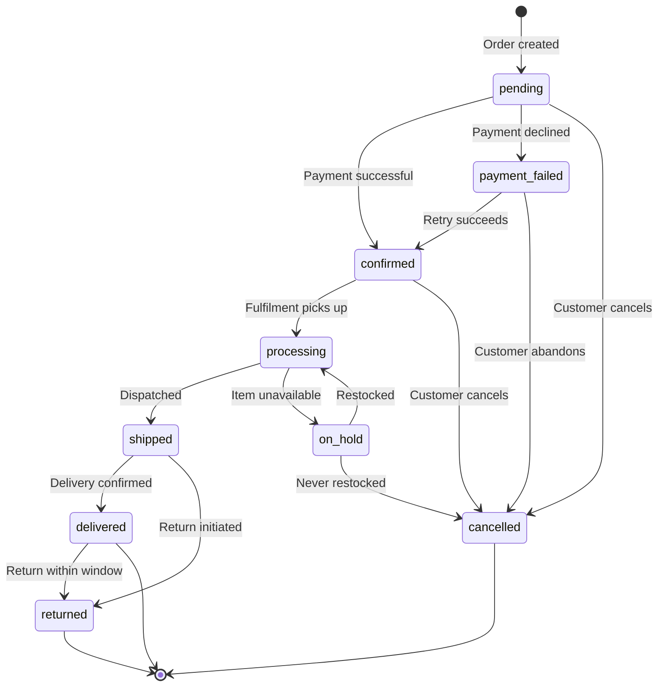
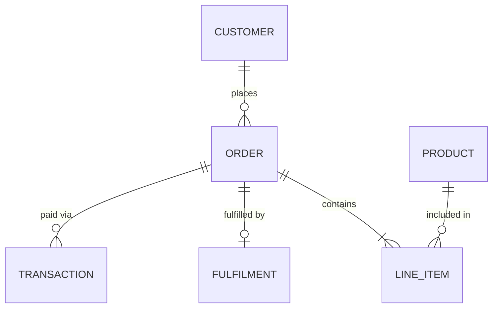

<ref-guide name="diagram-guide">

<brief>When to use diagrams, which type, and Mermaid patterns for each. Diagrams compress complex flows — use alongside prose, not instead of it. All diagrams use Mermaid.</brief>

<table name="diagram-selection">
<row situation="User flow with decision points" type="Flowchart"/>
<row situation="Multiple actors passing data or control" type="Sequence diagram"/>
<row situation="Entity moving through states" type="State diagram"/>
<row situation="Entities and how they relate" type="Entity-relationship diagram"/>
</table>

<section name="flowchart">
Use for: single-actor journeys, branching flows, step-by-step processes.

Shapes: `([text])` start/end, `[text]` process, `{text}` decision, `((text))` connector.
Tips: short labels, labelled decision branches, every branch reaches terminal or loops, TD for steps, LR for pipelines.
</section>

<section name="sequence-diagram">
Use for: multi-actor interactions, API flows, event-driven flows.

For failure paths:

Syntax: `->>` request, `-->>` response, `-x` failure, `actor` human, `participant` system.
Tips: 3-5 actors max, show response to every request, `Note over App: waits for webhook` for async.
</section>

<section name="state-diagram">
Use for: any entity with >2 states.

Tips: label every transition with trigger, every state reaches a terminal, group related states for large diagrams.
</section>

<section name="er-diagram">
Use for: entity relationships, cardinality, named relationships.

Cardinality: `||--||` one-to-one, `||--o|` one-to-zero-or-one, `||--|{` one-to-one-or-more, `||--o{` one-to-zero-or-more.
Tips: only fields that matter for understanding, plain English relationship labels, split by bounded context for large models.
</section>

<constraints name="when-to-split">
Split when: >8 nodes, >5 actors in sequence, >8 states, mixed concerns (normal flow + error paths).

How: flowcharts split at decision points (happy path first, then branches). Sequence diagrams split by phase or actor group. State diagrams split by lifecycle stage. ER diagrams split by bounded context.

Name consistently: Figure 3a, 3b, 3c.
</constraints>

<constraints name="when-not-to-use">
<c rule="Simple linear flows">No branches, one actor — prose is clearer</c>
<c rule="Mirrors prose exactly">Adds no value</c>
<c rule=">8 nodes or >6 actors">Split into sub-diagrams instead</c>
<c rule="As substitute for text">Diagrams cannot be searched or linked precisely</c>
</constraints>

Place diagrams after prose, not instead. Label every diagram with a caption for reference.

</ref-guide>
